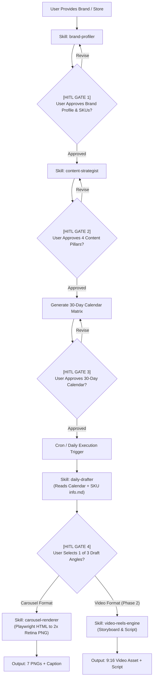

# AGENTS.md — My Content OS Project Protocol

## 1. Project Identity & Mission
`my-content-os` is an autonomous, multi-format content operating system. It ingests brand profiles and verified product knowledge bases to systematically ideate, draft, validate, and render production-grade social assets:
- **Phase 1 (MVP):** 7-Slide Instagram Carousels (1080x1350 px, 2x Retina DPR) with high-converting mobile typography, safe zones, and transparent product showcase slotting.
- **Phase 2 (Expansion):** Short-form vertical video (Instagram Reels / TikTok 9:16) with automated storyboarding, prompt generation, and voiceover scripts.

All project intelligence, rules, and skills are strictly self-contained within this repository under `.agents/`.

---

## 2. Repository Architecture

```text
my-content-os/
├── .agents/                                     # Antigravity Local Project Standard
│   ├── rules/
│   │   ├── content-guidelines.md                # Mobile typography, safe zones, copy rules
│   │   └── video-guidelines.md                  # Vertical 9:16 safe areas, Reels/TikTok pacing
│   └── skills/
│       ├── brand-profiler/SKILL.md              # Gate 1: Brand intake, tokens & product SKU setup
│       ├── content-strategist/SKILL.md          # Gate 2 & 3: 4 content pillars & 30-day calendar
│       ├── daily-drafter/SKILL.md               # Gate 4: 3 distinct angle drafts for approval
│       ├── carousel-renderer/                   # Playwright HTML to 2x Retina PNG engine
│       │   ├── SKILL.md
│       │   └── scripts/render.py
│       └── video-reels-engine/SKILL.md          # (Phase 2) Vertical video scripting & storyboarding
│
├── AGENTS.md                                    # Master project protocol & HITL gates
├── README.md                                    # Project runbook & execution instructions
├── requirements.txt                             # Python dependencies (playwright, jinja2)
│
├── brands/                                      # Single Source of Truth for Brand Knowledge
│   └── <brand-slug>/                            # e.g., mgt-indonesia
│       ├── profile.md                           # Tone, audience, visual hex tokens, store URL
│       ├── content-pillars.md                   # 4 verified content pillars
│       ├── calendar-30d.md                      # 30-day rotation calendar
│       ├── assets/                              # Brand logos, badges, background textures
│       └── products/
│           └── <sku-slug>/                      # e.g., bel-wireless-waterproof
│               ├── info.md                      # Technical specs, pain points, pricing, link
│               └── mockup.png                   # Transparent product cutout (Required)
│
├── templates/                                   # Visual Layout Templates
│   ├── carousels/
│   │   ├── magazine.html                        # High-Impact Magazine Archetype (Dark/Gold)
│   │   ├── minimalist.html                      # Minimalist Authority Archetype (Cream/Editorial)
│   │   ├── blueprint.html                       # Framework Breakdown Archetype (Tech/Cyan)
│   │   └── assets/                              # Backgrounds, mockups, textures
│   └── video-templates/                         # Storyboard presets & motion layouts
│
├── engine/                                      # Shared CLI Execution Engines
│   └── render.py                                # Playwright snapshot runner
│
└── output/                                      # Production Exports
    └── <brand-slug>_<date>/
        ├── slide_01.png ... slide_07.png
        └── caption.txt
```

---

## 3. Human-in-the-Loop (HITL) Protocol & Gates

The agent must NEVER proceed across stages without explicit user confirmation.



### Gate Definitions
1. **[HITL GATE 1] Brand & Product Approval:** Inspect `profile.md` and `products/<sku>/info.md`. Ensure product features are strictly fact-checked and `mockup.png` exists.
2. **[HITL GATE 2] Pillars Approval:** Verify 4 distinct strategic angles with clear persona resonance.
3. **[HITL GATE 3] Calendar Approval:** Verify 30-day rotation balance (educational, product spotlight, comparison, engagement).
4. **[HITL GATE 4] Draft Selection:** Present 3 distinct copywriting angles (e.g., *Relatable Pain Point*, *Problem-Solution Checklist*, *Myth vs Technical Truth*). User selects the winning angle before rendering begins.

---

## 4. Communication Standards
- **Chat & Discussion:** Casual Indonesian ("Bang"), direct, concise, zero corporate fluff.
- **Repository Files:** Strictly English for all markdown, code, comments, and schemas.
